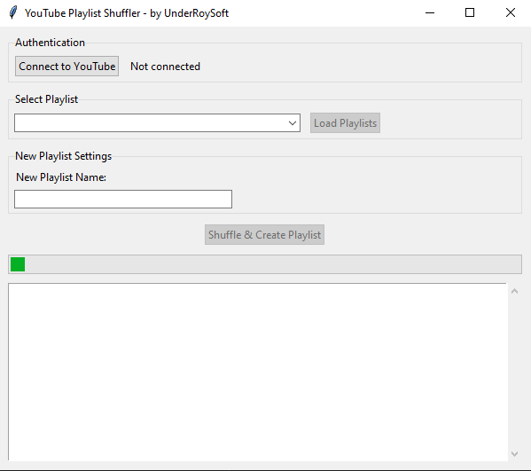

# YouTube Playlist Shuffler

A desktop application that shuffles your YouTube playlists and creates new randomized versions.

## Features
- Connect to your YouTube account securely
- Browse and select your existing playlists
- Shuffle videos in random order
- Create new playlists with shuffled content
- Simple, user-friendly interface

## Screenshots


## Prerequisites
- Python 3.8 or higher
- Google account with YouTube access
- Internet connection

## Installation Guide

### Step 1: Download the Project
```bash
git clone https://github.com/UnderRoySoft/youtube-playlist-shuffler.git
cd youtube-playlist-shuffler

### Step 2: Install Python Dependencies
bash# Using requirements.txt (recommended)
pip install -r requirements.txt

### Step 3: Set Up YouTube API Credentials
Go to Google Cloud Console
Create new project → Enable YouTube Data API v3
Create OAuth 2.0 credentials (Desktop application type)
Download the JSON file
Rename it to credentials.json
Place it in the project folder (same directory as main_gui.py)

### Step 4: Run the Application
bashpython main_gui.py

### First Run Setup
Click "Connect to YouTube" - browser will open
Sign in and grant permissions
Return to app - should show "Connected"
You are ready to shuffle playlists!

### How to Use
Connect: Click "Connect to YouTube" and authorize access
Load: Click "Load Playlists" to see your YouTube playlists
Select: Choose a playlist from the dropdown
Name: Enter a name for your new shuffled playlist
Shuffle: Click "Shuffle & Create Playlist"
Done: Check your YouTube account for the new playlist!

### Troubleshooting
"FileNotFoundError: credentials.json" → Make sure you renamed and placed the credentials file correctly
"No playlists found" → Ensure you have playlists in your YouTube account
Authentication fails → Check internet connection and API credentials
Quota exceeded → Wait until tomorrow (quotas reset daily) or request quota increase

### License
This project is open source. Feel free to use and modify.